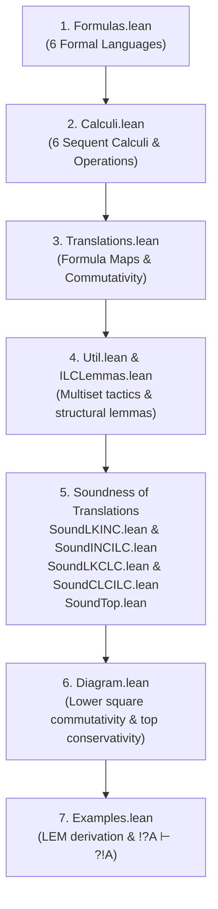

# Reading Guide: Sequent Calculi for a Unity of Logic

This document explains how to read and navigate the Lean 4 formalization of the paper:
> **"Sequent calculi for a unity of logic: Classicality is symmetric to non-linearity"**  
> by Norihiro Yamada ([`ArXivSequentCalculi.tex`](file:///home/srghma/projects/lean-melearning-2001.06138-sequent-calculi-for-a-unity-of-logic/ArXivSequentCalculi.tex)).

The entire formalization is contained in the [`RequestProject/Logics/`](file:///home/srghma/projects/lean-melearning-2001.06138-sequent-calculi-for-a-unity-of-logic/RequestProject/Logics) directory. It builds with **zero `sorry`** using Lean 4 and standard Mathlib axioms.

---

## 1. The Central Commutative Diagram

The entire project revolves around the commutative diagram from **Section 1.3** (lines 273–278) and **Section 3.4** (line 1178):

```mermaid
ILL        ──Girard's translation──▶  IL
 │ (conservative extension)            │ (conservative extension)
 ▼                                     ▼
ILLᵉ_ι     ──unlinearisation (_)_!──▶  ILᵉ
 │ classicalisation (_)_?              │ classicalisation (_)_?
 ▼                                     ▼
CLL⁻       ──unlinearisation (_)_!──▶  CL
```

### Key Intuitions from the Paper

* **Non-linearity** is the implicit placement of of-course `!` on the left: $(\_)_! : \Delta \vdash \Gamma \mapsto !\Delta \vdash \Gamma$.
* **Classicality** is the implicit placement of why-not `?` on the right: $(\_)_? : \Theta \vdash \Xi \mapsto \Theta \vdash ?\Xi$.
* **Linearity** is the absence of `!` on the left; **Intuitionisity** is the absence of `?` on the right.
* The two dimensions are completely **symmetric**.

---

## 2. Recommended Order of Reading

To understand the codebase systematically, read the files in the following order:



### Step 1: [`Formulas.lean`](file:///home/srghma/projects/lean-melearning-2001.06138-sequent-calculi-for-a-unity-of-logic/RequestProject/Logics/Formulas.lean) — The Six Formal Languages

Start here to see the inductively defined formula types for all six logics:

1. `CL.Formula`: Classical logic ($X, \mathrm{tt}, \mathrm{ff}, \wedge, \vee, \Rightarrow$).
2. `IL.Formula`: Intuitionistic logic ($X, \top, \mathrm{ff}, \&, \vee, \Rightarrow$).
3. `ILL.Formula`: Intuitionistic linear logic ($X, \top, \otimes, \&, \oplus, \multimap, !$).
4. `ILLe.Formula`: Extended intuitionistic linear logic $\text{ILL}^{\text{e}}_{(\iota)}$ ($X, \top, \bot, 1, 0, \otimes, ⅋, \&, \oplus, \neg, !, ?$).
5. `ILe.Formula`: Extended intuitionistic logic $\text{IL}^{\text{e}}$ ($X, \top, \mathrm{ff}, \&, \vee, \Rightarrow, ?$).
6. `CLLneg.Formula`: Classical linear logic negative $\text{CLL}^-$ ($X, \mathrm{tt}, \bot, \wedge, \oplus, \multimap, !$).

### Step 2: [`Calculi.lean`](file:///home/srghma/projects/lean-melearning-2001.06138-sequent-calculi-for-a-unity-of-logic/RequestProject/Logics/Calculi.lean) — The Six Sequent Calculi

Read the inductive provability predicates `Δ ⊢ Γ`:

* `CL.LK`: Gentzen's classical calculus **LK**.
* `IL.LJ`: Intuitionistic calculus **LJ** (at most one formula on the right, represented as `Option`).
* `ILL.LLJ`: Intuitionistic linear logic calculus **LLJ**.
* `ILLe.ILC ι`: The universal calculus **ILC** (`ι = false`) and **ILC_ι** (`ι = true`), the latter having the weakly distributive rules.
* `ILe.INC`: The calculus **INC** for $\text{IL}^{\text{e}}$.
* `CLLneg.CLC`: The calculus **CLC** for $\text{CLL}^-$.
* `Unlinearisation` and `Classicalisation`: Generic operations mapping `C` to $C_!$ and $C_?$.

### Step 3: [`Translations.lean`](file:///home/srghma/projects/lean-melearning-2001.06138-sequent-calculi-for-a-unity-of-logic/RequestProject/Logics/Translations.lean) — Maps Between Logics

Read how formulas are translated along the arrows of the diagram:

* `ILL.embed` and `IL.embed`: Conservative embeddings into the extended logics.
* `IL.girard` / `IL.girardE`: Girard's translation ($A \vee B \mapsto !A \oplus !B$, $A \Rightarrow B \mapsto !A \multimap B$).
* `ILe.T` and `CL.Tbang`: Unlinearisation translations $\mathcal{T}_!$.
* `CLLneg.T` and `CL.Twn`: Classicalisation translations $\mathcal{T}_?$.
* `CL.Tbangwn_eq_Twnbang`: Proves that on formulas, the lower square commutes: $\mathcal{T}_! \circ \mathcal{T}_? = \mathcal{T}_? \circ \mathcal{T}_!$.
* `IL.embed_girard`: Proves that on formulas, the upper square commutes.

### Step 4: [`Util.lean`](file:///home/srghma/projects/lean-melearning-2001.06138-sequent-calculi-for-a-unity-of-logic/RequestProject/Logics/Util.lean) & [`ILCLemmas.lean`](file:///home/srghma/projects/lean-melearning-2001.06138-sequent-calculi-for-a-unity-of-logic/RequestProject/Logics/ILCLemmas.lean) — Proof Machinery

* `Util.lean`: Provides the `msimpa` and `ms_eq` tactics to rewrite and normalize multiset contexts modulo commutativity and associativity.
* `ILCLemmas.lean`: Proves structural lemmas in **ILC / ILC_ι**, such as multiset-level contraction on `!` (`bangC_ctx`), on `?` (`wnC_ctx`), cut on single formulas (`cut_left`, `cut_right`), and derived linear rules (`bangWithL₁`, `bangWithL₂`, `bangLimpL`).

### Step 5: Soundness of Translations (The Four Quadrants & Top Row)

Each file proves that a translation preserves provability:

* **Lower Right (Route 1, first leg)**: [`SoundLKINC.lean`](file:///home/srghma/projects/lean-melearning-2001.06138-sequent-calculi-for-a-unity-of-logic/RequestProject/Logics/SoundLKINC.lean) proves `CL.LK.toINC` ($\text{LK} \to \text{INC}$).
* **Middle Horizontal (Route 1, second leg)**: [`SoundINCILC.lean`](file:///home/srghma/projects/lean-melearning-2001.06138-sequent-calculi-for-a-unity-of-logic/RequestProject/Logics/SoundINCILC.lean) proves `ILe.INC.toILC` ($\text{INC} \to \text{ILC}_\iota$).
* **Bottom Horizontal (Route 2, first leg)**: [`SoundLKCLC.lean`](file:///home/srghma/projects/lean-melearning-2001.06138-sequent-calculi-for-a-unity-of-logic/RequestProject/Logics/SoundLKCLC.lean) proves `CL.LK.toCLC` ($\text{LK} \to \text{CLC}$).
* **Lower Left (Route 2, second leg)**: [`SoundCLCILC.lean`](file:///home/srghma/projects/lean-melearning-2001.06138-sequent-calculi-for-a-unity-of-logic/RequestProject/Logics/SoundCLCILC.lean) proves `CLLneg.CLC.toILC` ($\text{CLC} \to \text{ILC}_\iota$).
* **Top Row**: [`SoundTop.lean`](file:///home/srghma/projects/lean-melearning-2001.06138-sequent-calculi-for-a-unity-of-logic/RequestProject/Logics/SoundTop.lean) proves:
  * `ILL.LLJ.toILC`: $\text{LLJ} \subseteq \text{ILC}_{(\iota)}$.
  * `IL.LJ.toILC`: Soundness of Girard's translation into $\text{ILC}_{(\iota)}$.

### Step 6: [`Diagram.lean`](file:///home/srghma/projects/lean-melearning-2001.06138-sequent-calculi-for-a-unity-of-logic/RequestProject/Logics/Diagram.lean) — Assembly of the Commutative Diagram

* `CL.LK.toILC_viaILe`: Compiles the route $\text{LK} \to \text{INC} \to \text{ILC}_\iota$ ($\mathcal{T}_{!?}$).
* `CL.LK.toILC_viaCLLneg`: Compiles the route $\text{LK} \to \text{CLC} \to \text{ILC}_\iota$ ($\mathcal{T}_{?!}$).
* `CL.LK.routes_agree`: Proves that both routes yield the **exact same sequent** $!\mathcal{T}(\Delta) \vdash ?\mathcal{T}(\Gamma)$ in $\text{ILC}_\iota$.
* `ILL.ILCConservative` & `IL.INCConservative`: States the conservativity conjectures/theorems of the vertical extensions.
* `IL.LJ.toLLJ_of_conservative`: Proves that assuming conservativity, Girard's translation sends $\text{LJ}$ proofs into $\text{LLJ}$.

### Step 7: [`Examples.lean`](file:///home/srghma/projects/lean-melearning-2001.06138-sequent-calculi-for-a-unity-of-logic/RequestProject/Logics/Examples.lean) — Concrete Proofs

* `CL.LK.lem`: Derives the Law of Excluded Middle ($\vdash \mathbin{\sim} A \vee A$) in **LK** following Gentzen's proof in the paper.
* `example`: Shows its translation $\vdash ?\mathcal{T}(\mathbin{\sim} A \vee A)$ is provable in $\text{ILC}_\iota$.
* `ILLe.ILC.bang_wn_le_wn_bang`: Derives $!?A \vdash ?!A$ in $\text{ILC}_\iota$ using the weakly distributive rule.

---

## 3. Chapter-by-Chapter Mapping to the Paper (`ArXivSequentCalculi.tex`)

| Book Chapter / Section | PDF Reference | Concept in Paper | Lean Declaration & File |
| :--- | :--- | :--- | :--- |
| **Section 1.3** Main results | PDF p. 3 | Commutativity of the diagram (informal theorem) | [`Diagram.lean`](file:///home/srghma/projects/lean-melearning-2001.06138-sequent-calculi-for-a-unity-of-logic/RequestProject/Logics/Diagram.lean) |
| **Section 1.3** Main results | **Definition 1.1**, PDF p. 4 | Unlinearisation $(\\_)_! : \Delta \vdash \Gamma \mapsto !\Delta \vdash \Gamma$ | [`Unlinearisation`](file:///home/srghma/projects/lean-melearning-2001.06138-sequent-calculi-for-a-unity-of-logic/RequestProject/Logics/Calculi.lean#L305-L310) in `Calculi.lean` |
| **Section 1.3** Main results | **Definition 1.1**, PDF p. 4 | Classicalisation $(\\_)_? : \Theta \vdash \Xi \mapsto \Theta \vdash ?\Xi$ | [`Classicalisation`](file:///home/srghma/projects/lean-melearning-2001.06138-sequent-calculi-for-a-unity-of-logic/RequestProject/Logics/Calculi.lean#L311-L316) in `Calculi.lean` |
| **Section 2.1** Classical & Intuitionistic | **Definition 2.2**, PDF p. 8 | Formulas of Classical Logic (CL) | [`CL.Formula`](file:///home/srghma/projects/lean-melearning-2001.06138-sequent-calculi-for-a-unity-of-logic/RequestProject/Logics/Formulas.lean#L30-L46) in `Formulas.lean` |
| **Section 2.1** Classical & Intuitionistic | **Definition 2.4 + Figure 1**, PDF p. 8–9 | Sequent Calculus **LK** for CL | [`CL.LK`](file:///home/srghma/projects/lean-melearning-2001.06138-sequent-calculi-for-a-unity-of-logic/RequestProject/Logics/Calculi.lean#L48-L72) in `Calculi.lean` |
| **Section 2.1** Classical & Intuitionistic | **Definition 2.5**, PDF p. 8 | Formulas of Intuitionistic Logic (IL) | [`IL.Formula`](file:///home/srghma/projects/lean-melearning-2001.06138-sequent-calculi-for-a-unity-of-logic/RequestProject/Logics/Formulas.lean#L49-L65) in `Formulas.lean` |
| **Section 2.1** Classical & Intuitionistic | **Definition 2.7**, PDF p. 8 | Sequent Calculus **LJ** for IL | [`IL.LJ`](file:///home/srghma/projects/lean-melearning-2001.06138-sequent-calculi-for-a-unity-of-logic/RequestProject/Logics/Calculi.lean#L81-L102) in `Calculi.lean` |
| **Section 2.1** Classical & Intuitionistic | PDF p. 8 | Derivation of LEM $\vdash \mathbin{\sim} A \vee A$ in LK | [`CL.LK.lem`](file:///home/srghma/projects/lean-melearning-2001.06138-sequent-calculi-for-a-unity-of-logic/RequestProject/Logics/Examples.lean#L20-L30) in `Examples.lean` |
| **Section 2.2** Linear Logics | **Definition 2.10**, PDF p. 10 | Formulas of CLL and ILL | [`ILL.Formula`](file:///home/srghma/projects/lean-melearning-2001.06138-sequent-calculi-for-a-unity-of-logic/RequestProject/Logics/Formulas.lean#L68-L84) in `Formulas.lean` |
| **Section 2.2** Linear Logics | **Definition 2.13**, PDF p. 12 | Sequent Calculus **LLJ** for ILL | [`ILL.LLJ`](file:///home/srghma/projects/lean-melearning-2001.06138-sequent-calculi-for-a-unity-of-logic/RequestProject/Logics/Calculi.lean#L111-L138) in `Calculi.lean` |
| **Section 2.2** Linear Logics | PDF p. 12 | Girard's Translation $\text{IL} \to \text{ILL}$ | [`IL.girard`](file:///home/srghma/projects/lean-melearning-2001.06138-sequent-calculi-for-a-unity-of-logic/RequestProject/Logics/Translations.lean#L93-L100), [`IL.girardE`](file:///home/srghma/projects/lean-melearning-2001.06138-sequent-calculi-for-a-unity-of-logic/RequestProject/Logics/Translations.lean#L102-L104) in `Translations.lean` |
| **Section 3.1** Ext. Intuitionistic Linear Logic | **Definition 3.2**, PDF p. 13 | Formulas of $\text{ILL}^{\text{e}}_{(\iota)}$ | [`ILLe.Formula`](file:///home/srghma/projects/lean-melearning-2001.06138-sequent-calculi-for-a-unity-of-logic/RequestProject/Logics/Formulas.lean#L94-L118) in `Formulas.lean` |
| **Section 3.1** Ext. Intuitionistic Linear Logic | **Definition 3.3 + Figure 3**, PDF p. 13–14 | Sequent Calculus **ILC** for $\text{ILL}^{\text{e}}$ | [`ILLe.ILC false`](file:///home/srghma/projects/lean-melearning-2001.06138-sequent-calculi-for-a-unity-of-logic/RequestProject/Logics/Calculi.lean#L148-L203) in `Calculi.lean` |
| **Section 3.1** Ext. Intuitionistic Linear Logic | **Definition 3.4**, PDF p. 13 | Sequent Calculus **ILC_ι** with weakly distributive rules | [`ILLe.ILC true`](file:///home/srghma/projects/lean-melearning-2001.06138-sequent-calculi-for-a-unity-of-logic/RequestProject/Logics/Calculi.lean#L195-L202) in `Calculi.lean` |
| **Section 3.1** Ext. Intuitionistic Linear Logic | **Corollary 3.7**, PDF p. 16 | $\text{ILC}_{(\iota)}$ as a conservative extension of LLJ | [`ILL.LLJ.toILC`](file:///home/srghma/projects/lean-melearning-2001.06138-sequent-calculi-for-a-unity-of-logic/RequestProject/Logics/SoundTop.lean#L31-L69) in `SoundTop.lean`, statement in [`Diagram.lean`](file:///home/srghma/projects/lean-melearning-2001.06138-sequent-calculi-for-a-unity-of-logic/RequestProject/Logics/Diagram.lean#L80-L86) |
| **Section 3.2** Ext. Intuitionistic Logic | **Definition 3.11**, PDF p. 20 | Formulas of $\text{IL}^{\text{e}}$ | [`ILe.Formula`](file:///home/srghma/projects/lean-melearning-2001.06138-sequent-calculi-for-a-unity-of-logic/RequestProject/Logics/Formulas.lean#L130-L139) in `Formulas.lean` |
| **Section 3.2** Ext. Intuitionistic Logic | **Definition 3.12 + Figure 4**, PDF p. 20–21 | Sequent Calculus **INC** for $\text{IL}^{\text{e}}$ | [`ILe.INC`](file:///home/srghma/projects/lean-melearning-2001.06138-sequent-calculi-for-a-unity-of-logic/RequestProject/Logics/Calculi.lean#L211-L250) in `Calculi.lean` |
| **Section 3.2** Ext. Intuitionistic Logic | **Corollary 3.14**, PDF p. 20 | INC as a conservative extension of LJ | [`IL.INCConservative`](file:///home/srghma/projects/lean-melearning-2001.06138-sequent-calculi-for-a-unity-of-logic/RequestProject/Logics/Diagram.lean#L93-L98) in `Diagram.lean` |
| **Section 3.2** Ext. Intuitionistic Logic | **Lemma 3.15**, PDF p. 22 | Translation $\mathcal{T}_?$ of LK into INC | [`CL.LK.toINC`](file:///home/srghma/projects/lean-melearning-2001.06138-sequent-calculi-for-a-unity-of-logic/RequestProject/Logics/SoundLKINC.lean#L57-L118) in `SoundLKINC.lean` |
| **Section 3.2** Ext. Intuitionistic Logic | **Lemma 3.16**, PDF p. 23 | Translation $\mathcal{T}_!$ of INC into $\text{ILC}_\iota$ | [`ILe.INC.toILC`](file:///home/srghma/projects/lean-melearning-2001.06138-sequent-calculi-for-a-unity-of-logic/RequestProject/Logics/SoundINCILC.lean#L29-L79) in `SoundINCILC.lean` |
| **Section 3.2** Ext. Intuitionistic Logic | **Corollary 3.18**, PDF p. 25 | Translation $\mathcal{T}_{!?}$ of LK into $\text{ILC}_\iota$ | [`CL.LK.toILC_viaILe`](file:///home/srghma/projects/lean-melearning-2001.06138-sequent-calculi-for-a-unity-of-logic/RequestProject/Logics/Diagram.lean#L44-L51) in `Diagram.lean` |
| **Section 3.3** Classical Linear Logic Negative | **Definition 3.19**, PDF p. 25 | Formulas of $\text{CLL}^-$ | [`CLLneg.Formula`](file:///home/srghma/projects/lean-melearning-2001.06138-sequent-calculi-for-a-unity-of-logic/RequestProject/Logics/Formulas.lean#L141-L160) in `Formulas.lean` |
| **Section 3.3** Classical Linear Logic Negative | **Definition 3.20 + Figure 5**, PDF p. 25–26 | Sequent Calculus **CLC** for $\text{CLL}^-$ | [`CLLneg.CLC`](file:///home/srghma/projects/lean-melearning-2001.06138-sequent-calculi-for-a-unity-of-logic/RequestProject/Logics/Calculi.lean#L257-L301) in `Calculi.lean` |
| **Section 3.3** Classical Linear Logic Negative | **Lemma 3.22**, PDF p. 26 | Translation $\mathcal{T}_!$ of LK into CLC | [`CL.LK.toCLC`](file:///home/srghma/projects/lean-melearning-2001.06138-sequent-calculi-for-a-unity-of-logic/RequestProject/Logics/SoundLKCLC.lean#L61-L127) in `SoundLKCLC.lean` |
| **Section 3.3** Classical Linear Logic Negative | **Lemma 3.23**, PDF p. 27 | Translation $\mathcal{T}_?$ of CLC into $\text{ILC}_\iota$ | [`CLLneg.CLC.toILC`](file:///home/srghma/projects/lean-melearning-2001.06138-sequent-calculi-for-a-unity-of-logic/RequestProject/Logics/SoundCLCILC.lean#L28-L100) in `SoundCLCILC.lean` |
| **Section 3.3** Classical Linear Logic Negative | **Corollary 3.25**, PDF p. 29 | Translation $\mathcal{T}_{?!}$ of LK into $\text{ILC}_\iota$ | [`CL.LK.toILC_viaCLLneg`](file:///home/srghma/projects/lean-melearning-2001.06138-sequent-calculi-for-a-unity-of-logic/RequestProject/Logics/Diagram.lean#L53-L60) in `Diagram.lean` |
| **Section 3.4** Commutative Unity of Logic | **Theorem 3.26**, PDF p. 29 | Commutative unity of logic | [`CL.Tbangwn_eq_Twnbang`](file:///home/srghma/projects/lean-melearning-2001.06138-sequent-calculi-for-a-unity-of-logic/RequestProject/Logics/Translations.lean#L145-L159), [`CL.LK.routes_agree`](file:///home/srghma/projects/lean-melearning-2001.06138-sequent-calculi-for-a-unity-of-logic/RequestProject/Logics/Diagram.lean#L63-L70) |
| **Section 3.5** Conservative Translations | **Figure 6**, PDF p. 30 | Conservative translations commutative diagram | [`Diagram.lean`](file:///home/srghma/projects/lean-melearning-2001.06138-sequent-calculi-for-a-unity-of-logic/RequestProject/Logics/Diagram.lean) |
| **Section 3.5** Conservative Translations | **Corollary 3.37**, PDF p. 35 | Conservative translations (conditional on cut-elimination) | [`IL.LJ.toLLJ_of_conservative`](file:///home/srghma/projects/lean-melearning-2001.06138-sequent-calculi-for-a-unity-of-logic/RequestProject/Logics/Diagram.lean#L112-L131) in `Diagram.lean` |
| **Appendix A** | PDF p. 38 | Proof of Corollary 3.7; Axiom Dist `!?A ⊢ ?!A` | [`ILLe.ILC.bang_wn_le_wn_bang`](file:///home/srghma/projects/lean-melearning-2001.06138-sequent-calculi-for-a-unity-of-logic/RequestProject/Logics/Examples.lean#L40-L46) in `Examples.lean` |

---

## 4. Formalization Choices & Notes

When comparing the Lean source code to the LaTeX manuscript, note the following design choices:

1. **Multiset contexts:**  
   Sequent contexts ($\Delta, \Gamma$) are typed as `Multiset (Formula α)`. As a result, the exchange rules (**XL** and **XR**) are completely absorbed by multiset equality and do not appear as inference rules in any of the inductive calculi.
2. **Intuitionistic right-hand sides:**  
   Sequents of **LJ** and **LLJ** have at most one formula on the right. In Lean, this is represented by an `Option (Formula α)` using the helper [`optMs`](file:///home/srghma/projects/lean-melearning-2001.06138-sequent-calculi-for-a-unity-of-logic/RequestProject/Logics/Formulas.lean#L163) (empty for `none`, singleton for `some b`).
3. **LJ rule formulation:**  
   The paper has two descriptions of LJ: the informal prose (which mentions right weakening) and the explicit figure (inside an `\if0` block in the TeX source, Figure 2). The formalization follows the explicit figure (standard $\Rightarrow$L without right weakening), which is necessary for **INC** to be a conservative extension of **LJ**.
4. **Girard's translation:**  
   The paper's standard Girard translation `IL.girard` is partial (`Option (ILL.Formula α)`) because ILL lacks falsity constants ($0$ or $\bot$). The total translation `IL.girardE` targets $\text{ILL}^{\text{e}}$, mapping $\mathrm{ff} \mapsto !\bot$.
5. **Provability vs Proof trees:**  
   The paper states that the two routes $\mathcal{T}_{!?}$ and $\mathcal{T}_{?!}$ coincide "modulo permuting axioms and rules". In Lean, calculi are formalized as provability predicates (`Prop`), so commutativity is proved at the level of sequents: both routes produce the *identical* provable sequent $!\mathcal{T}(\Delta) \vdash ?\mathcal{T}(\Gamma)$ in $\text{ILC}_\iota$.
6. **Conservativity proofs:**  
   The conservativity statements of the top vertical arrows ([`ILL.ILCConservative`](file:///home/srghma/projects/lean-melearning-2001.06138-sequent-calculi-for-a-unity-of-logic/RequestProject/Logics/Diagram.lean#L80) and [`IL.INCConservative`](file:///home/srghma/projects/lean-melearning-2001.06138-sequent-calculi-for-a-unity-of-logic/RequestProject/Logics/Diagram.lean#L93)) are stated as `Prop`s. Their forward soundness direction is proved (`LLJ.toILC`), while the backward conservativity relies on cut-elimination theorems which are not formalized.

---

## 5. Building and Verifying

To compile and verify all proofs:

```bash
lake build
```

The build completes successfully with no warnings or errors.
